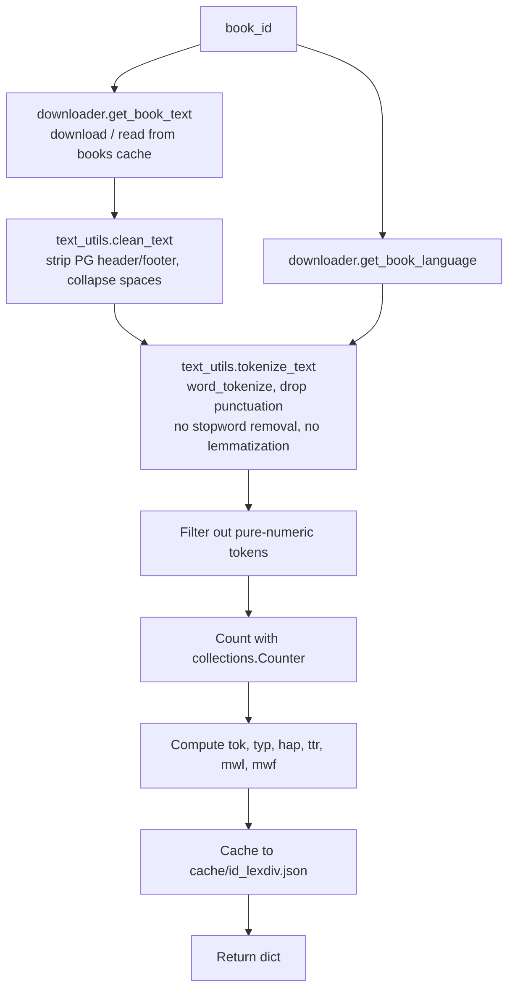
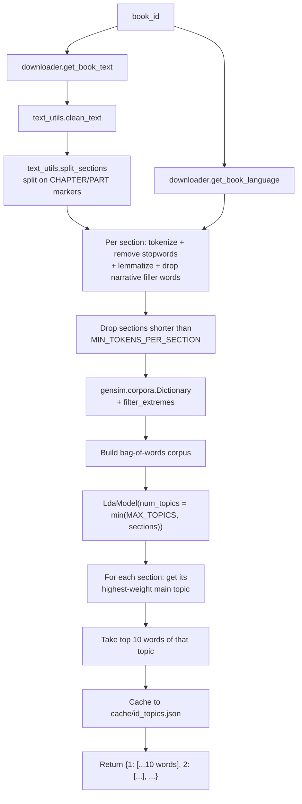
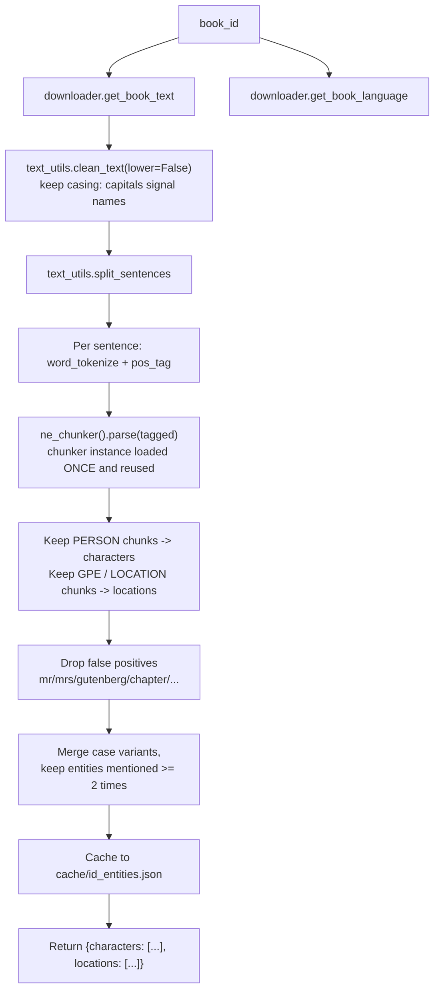
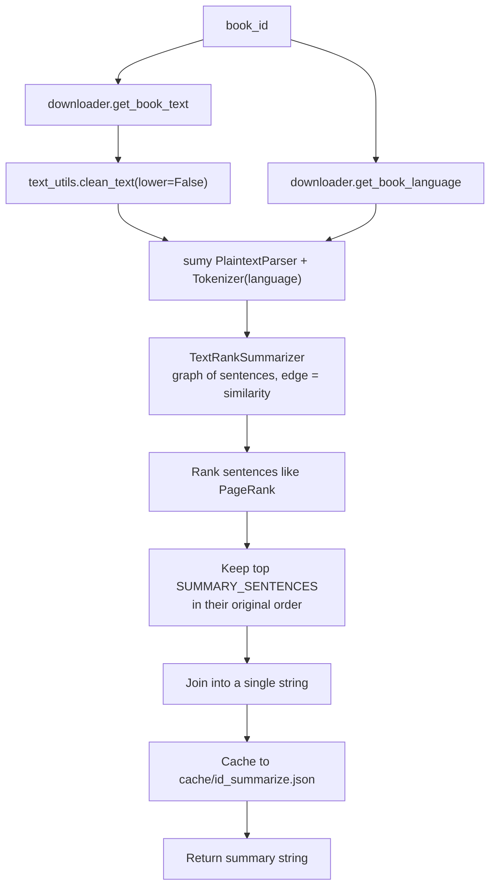
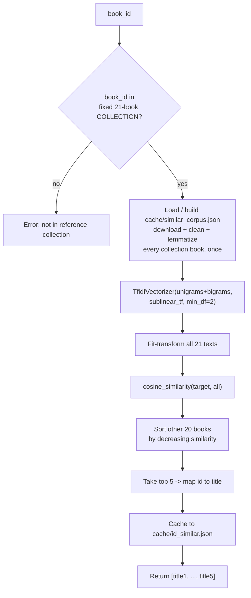
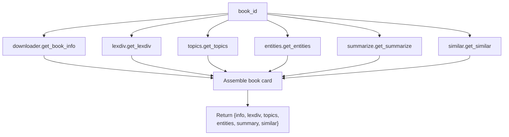

# bookworm
 
CLI qui télécharge des livres depuis Project Gutenberg et en extrait des
infos : diversité lexicale, topics, entités nommées, résumé, livres
similaires.
 
## Lancer le projet
 
1. Installer Python et les paquets nécessaires
```bash
sudo apt update
sudo apt install python3 python3-venv python3-pip -y
```
 
2. Créer et activer l'environnement virtuel
```bash
python3 -m venv venv
source venv/bin/activate
```
 
3. Installer les dépendances
```bash
pip install -r requirements.txt
```
 
4. Lancer une commande
```bash
python3 bookworm.py --card 11
```
 
Au premier lancement, NLTK télécharge automatiquement les ressources
dont il a besoin (tokenizer, stopwords, etc), aucune étape manuelle.
 
## Usage
 
```
python3 bookworm.py --lexdiv <ID>      # diversité lexicale
python3 bookworm.py --topics <ID>      # topics par section
python3 bookworm.py --entities <ID>    # personnages / lieux
python3 bookworm.py --summarize <ID>   # résumé
python3 bookworm.py --similar <ID>     # 5 livres proches
python3 bookworm.py --card <ID>        # tout combiné
```
 
`<ID>` = id Gutenberg (ex : 11 = Alice au pays des merveilles). Une
seule option à la fois. Id invalide ou réseau down → message d'erreur
clair, pas de crash.
 
## Structure
 
```
bookworm.py
modules/
  downloader.py     téléchargement + cache (API Gutendex)
  text_utils.py     clean / tokenize / lemmatize / split en sections
  lexdiv.py
  entities.py
  topics.py
  summarize.py
  similar.py
  card.py           regroupe tout
diagrams/           un diagramme par tâche
requirements.txt
```
 
## Cache
 
Les livres téléchargés (`books/`) et les résultats calculés (`cache/`)
sont exclus du repo via `.gitignore`. Supprimables sans risque, tout
se retélécharge/recalcule automatiquement au prochain lancement.
 
## Organisation Git
 
Une branche par tâche (`feature_lexdiv`, `feature_entities`, etc.),
mergée dans `dev`, puis `dev` mergé dans `main` une fois le cœur du
projet stable et testé.
 
Convention de commits : `<type>(<scope>): <description>` —
`feat`, `docs`, `chore`.
 
## Notes techniques
 
- **lexdiv** : pas de lemmatisation, on veut le vrai vocabulaire de
  l'auteur, pas sa forme normalisée.
- **topics** : sections = chapitres (regex CHAPTER/PART). LDA, max 8
  topics même s'il y a plus de chapitres.
- **entities** : NER phrase par phrase. Charger le chunker NLTK une
  seule fois et le réutiliser (pas `ne_chunk()` direct à chaque appel)
  — sinon un livre entier passe de ~7s à ~13min.
- **summarize** : TextRank (`sumy`), extractif.
- **similar** : collection fixe de 21 livres (celle du sujet), TF-IDF
  + cosinus.
  
## Limites connues
 
- NER pas hyper précis (modèle statistique léger, pas deep learning)
- `--similar` marche seulement sur les 21 livres de la collection fixe
- optimisé pour l'anglais, autres langues moins fiables

## Diagrammes
 
### lexdiv
 

 
### topics
 

 
### entities
 

 
### summarize
 

 
### similar
 

 
### card
 

 